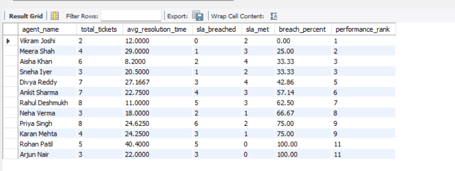
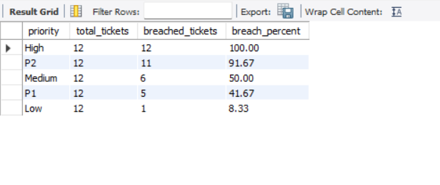
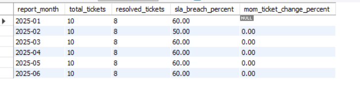
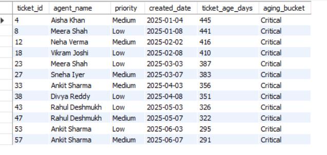

# 📊 IT Support SLA Analytics (SQL Project)

## 🧠 Problem Statement

In IT support teams, a lot of ticket data is generated daily, but it is often difficult to clearly understand:

- Which agents are performing well
- Whether SLAs are being met consistently
- How backlog is building up over time

This project focuses on analyzing support ticket data using SQL to answer these operational questions.

---

## 🗂️ Data Model

The dataset simulates an IT support system with the following tables:

- **agents** → Support staff details  
- **customers** → Client information  
- **tickets** → Issue tracking and resolution data  
- **sla_rules** → SLA thresholds based on priority  

---

## 📈 Key Analyses

---

### 🔹 1. Agent Performance Analysis

**Business Problem:**  
Evaluate how efficiently support agents handle tickets and meet SLA expectations.

**What was done:**
- Joined tickets, agents, and SLA tables
- Calculated SLA breaches
- Measured resolution time
- Ranked agents using window functions

📸 Output:  

---

### 🔹 2. SLA Breach Analysis

**Business Problem:**  
Identify which ticket priorities are most likely to violate SLA commitments.

**What was done:**
- Compared resolution time with SLA thresholds
- Aggregated breach counts by priority
- Calculated breach percentage

📸 Output:  

---

### 🔹 3. Monthly Trend Analysis

**Business Problem:**  
Track ticket volume trends and monitor operational changes over time.

**What was done:**
- Aggregated monthly ticket counts
- Calculated SLA breach percentage per month
- Used window functions (LAG) for MoM change

📸 Output:  

---

### 🔹 4. Backlog Aging Analysis

**Business Problem:**  
Identify unresolved tickets and categorize them based on how long they have been pending.

**What was done:**
- Filtered open tickets
- Calculated ticket age using DATEDIFF
- Categorized into aging buckets (Fresh, Moderate, Aging, Critical)

📸 Output:  

---

## 🔍 Key Insights

- High priority tickets show **extremely high SLA breach rates**, indicating inefficiencies in handling critical issues
- Some agents consistently have **higher breach percentages**, highlighting performance gaps
- Ticket volume remains **stable across months**, indicating no growth or reduction in workload
- A significant portion of tickets fall under the **"Critical" aging bucket**, showing backlog risk

---

## 🛠️ Tools & Skills Used

- SQL (MySQL)
- Joins & Aggregations
- Common Table Expressions (CTE)
- Window Functions (RANK, LAG)
- Case-based logic for business rules

---

## 🎯 Conclusion

This project helped me understand how SQL can be used to analyze operational data and answer real business questions.

Instead of just writing queries, the focus was on:
- identifying problems
- applying logic
- interpreting results

This approach is closer to how SQL is used in real analyst roles.

## 📁 Project Structure
